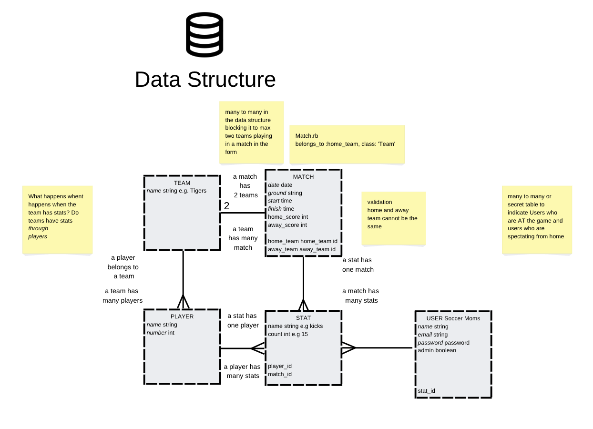

# SIDELINES

## Chat and track stats at the game
---

Link - [SIDELINES Live Site](https://deepabst.github.io/sideline-app-frontend/#/)

### Test User Credentials 
user: `jwinger@ga.com`
password: `chicken`

user: `aedison@ga.com`
password: `chicken`

user: `tbarnes@ga.com`
password: `chicken`

Link - [Backend Repo](https://github.com/rainpyr/real-time-chat)

### Description
This app aspires to be loaded on every phone at Saturday morning sport matches. Spectating parents, coaches or friends can track thier favourite teams or players stats while chatting online with other stat gatherers or those who couldn't make it to the game.

### Background

Software Engineer Immersive course group project 2 - built during week 9 of 12 at General Assembly Sydney. After 1 week of exposure to React and 8 weeks total coding experience.
Our task- build a full web app from front to back.
A project full of firsts! This was our first go at version control in a team setting, managing git branches and merge conflicts on the fly. Our first time attempting realtime data transfer via websockets. It was also a first time getting a login to work from a react front end to a rails backend.

### Main features
Login/logout - React FrontEnd to Rails Backend using knock and jwt
Teams Players Stats - Create Read Update and Delete
Create Chatrooms

### Screenshots
Data models

### Libraries
- action-cable-react-jwt
- axios
- bootstrap
- gh-pages
- react
- react-bootstrap
- react-dom
- react-router-dom

### Deploy locally

Start the backend first (details here -> [Link](https://github.com/rainpyr/real-time-chat) )

$ `npm install`

$ `npm start`

### Production Deployment - Dev Ops

$ `npm run deploy` - deploy to GitHub Pages

### Known bugs
websockets connection not working yet

### Wishlist
- match day stat tracking (register via QR code onsite)
- live action ticker
- mobile friendly design
- offline mode for poor connectivity
- google sign up / login
- undo stats function to de-duplicate

### Contributors
- [Eva Peng](https://github.com/rainpyr)
- [Dee Pabst](https://github.com/deepabst)
